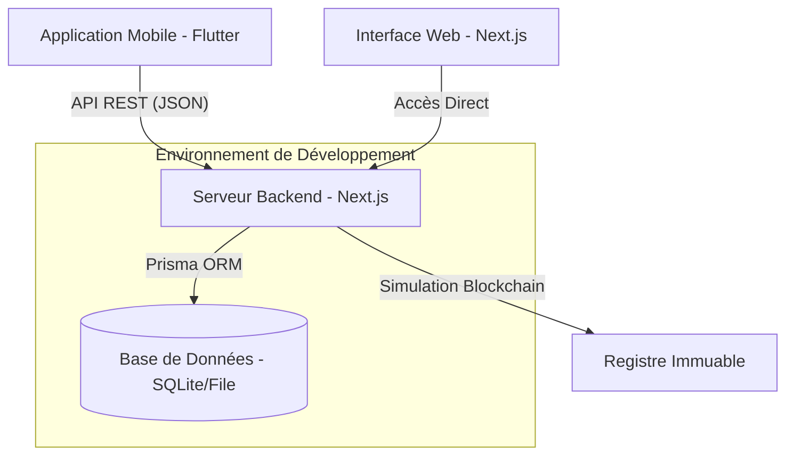

# CoopLedger : Écosystème de Gouvernance Agricole Blockchain

Cette documentation présente l'architecture technique et les points clés pour le pitch du projet CoopLedger, intégrant une plateforme Web (Next.js) et une application Mobile (Flutter).

## 1. Vision du Projet
CoopLedger est une solution SaaS conçue pour les coopératives agricoles. Elle utilise la technologie Blockchain pour garantir la transparence des transactions financières et l'intégrité des votes de gouvernance, renforçant ainsi la confiance entre les membres et les dirigeants.

---

## 2. Architecture Technique

### Schéma des Connexions

### Rôles des Composants
- **Web (Next.js)** : Centre de contrôle. Utilisé par les administrateurs (Président, Trésorier) pour créer des propositions, valider des transactions et gérer les membres.
- **Mobile (Flutter)** : Outil de proximité. Utilisé par les membres pour voter en temps réel, consulter leur solde et suivre les décisions de la coopérative depuis le champ.
- **API (Next.js API Routes)** : Le pont qui permet au mobile de communiquer avec le serveur central de manière sécurisée (JWT).

---

## 3. Points Clés pour le Pitch (Arguments de Vente)

1.  **Transparence Totale** : Chaque franc dépensé ou chaque vote émis est enregistré sur un registre "Blockchain" infalsifiable, consultable par tous via l'Explorateur.
2.  **Démocratie Directe** : Les membres reçoivent des notifications pour les nouveaux votes et participent instantanément aux décisions (achat de matériel, fixation des prix).
3.  **Inclusion Financière** : Le dashboard mobile permet aux agriculteurs de suivre leur situation financière sans avoir besoin de se déplacer au bureau de la coopérative.
4.  **Auditabilité** : Un historique complet (Audit Trail) permet de vérifier l'intégrité de chaque bloc de données.

---

## 4. Pré-requis de Connexion (Mobile -> Web)

Pour que l'application mobile fonctionne avec le serveur web, voici ce dont on a besoin :

- **URL de l'API** : Par défaut, configurée sur `http://10.0.2.2:3000/api` pour les émulateurs Android. Pour un appareil réel, il faut l'IP locale de la machine hôte.
- **Authentification** : Utilise des jetons **JWT**. Un login réussi renvoie un token qui doit être inclus dans chaque requête mobile.
- **Endpoints principaux** :
    - `/auth/login` : Connexion et récupération du rôle.
    - `/transactions` : Liste des entrées/sorties de fonds.
    - `/proposals` : Liste des votes en cours.
    - `/vote` : Enregistrement d'un choix sur la blockchain.

---

## 5. Instructions de Configuration pour le Pitch

Si quelqu'un doit faire une démo, il doit :
1.  **Lancer le Web** : `npm run dev` à la racine (assure que le serveur tourne sur le port 3000).
2.  **Lancer le Mobile** : Utiliser le SDK Flutter local situé dans `sdks/flutter/bin/flutter run`.
3.  **Données de Test** : Utiliser les comptes pré-configurés (ex: `president@coop.com` / `admin123`).

> [!IMPORTANT]
> L'innovation majeure réside dans la **synchronisation instantanée**. Un vote validé sur mobile apparaît immédiatement comme "Confirmé" sur le dashboard web de l'administrateur.
